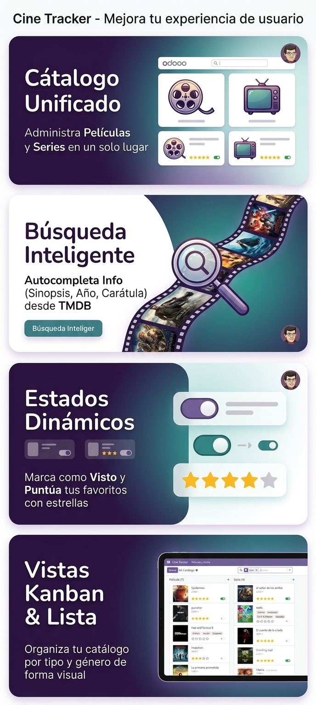

# 🎬 Cine Tracker for Odoo 18

<p align="center">
  
</p>

> **Manage your personal Movie & TV Series collection directly from Odoo with automatic TMDB integration.**


---

# ✨ Overview

**Cine Tracker** transforms Odoo into a personal multimedia catalog where you can organize your favorite **Movies** and **TV Series**, rate them, keep track of what you've watched and automatically retrieve information from **TMDB (The Movie Database)**.

Instead of manually filling every field, simply enter a title and let TMDB complete the rest.

---

# 🚀 Main Features

## 🎥 Personal Movie & TV Series Library

Manage all your content from one place.

✔ Movies

✔ TV Series

✔ Release year

✔ Genres

✔ Personal rating

✔ Watched status

---

## 🌍 TMDB Integration

Retrieve information automatically.

- Movie poster
- Overview
- Genres
- Release year
- Original title

Everything with a single click.

---

## 🎨 Modern User Interface

Designed following the latest Odoo 18 interface.

Features include:

- Beautiful Kanban cards
- Fast List View
- Search filters
- Dynamic badges
- Responsive layouts

---

## ⚙ Easy Configuration

The module automatically detects whether the TMDB API Key has been configured.

If no API Key exists:

✔ Configuration panel is displayed.

After configuration:

✔ It disappears automatically.

No unnecessary settings remain visible.

---

# 📷 Screenshots

## Kanban View


---

# 📦 Installation

1. Copy the module into your Odoo addons directory.

2. Update Apps List.

3. Install **Cine Tracker**.

4. Configure your TMDB API Key.

5. Start adding movies.

---

# 🔑 TMDB API

This module uses the free API provided by:

https://www.themoviedb.org/

Create your free API Key and configure it inside Odoo.

---

# 📂 Module Structure

```
movie_series_tracker/
├── __init__.py
├── __manifest__.py
├── models/
├── security/
├── static/
└── views/
```

---

# 💡 Perfect For

- Movie collectors
- TV series enthusiasts
- Home cinema lovers
- Personal media management

---

# ❤️ Why Cine Tracker?

Unlike generic catalog applications, Cine Tracker is fully integrated into Odoo and follows its native interface.

It combines:

- Beautiful UI
- Automatic metadata
- Fast management
- Odoo ORM architecture
- Native Odoo experience

---

# 👨‍💻 Author

**Mateo Goran**

GitHub

https://github.com/mateogoranDev

---

# ⭐ Support the Project

If you enjoy this module:

⭐ Rate it on Odoo Apps

⭐ Follow future releases

⭐ Report issues and suggestions

Enjoy managing your personal movie collection!